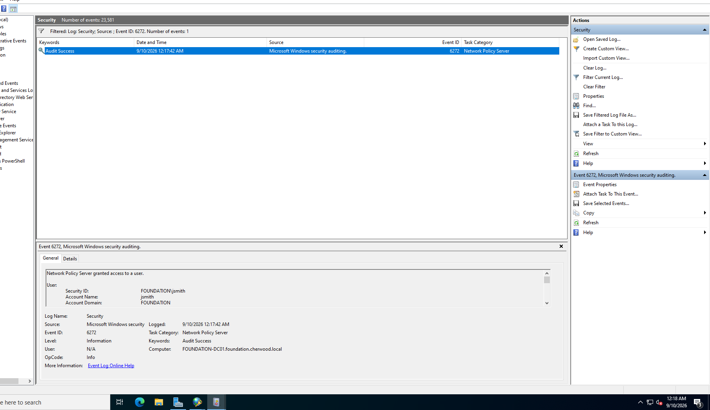
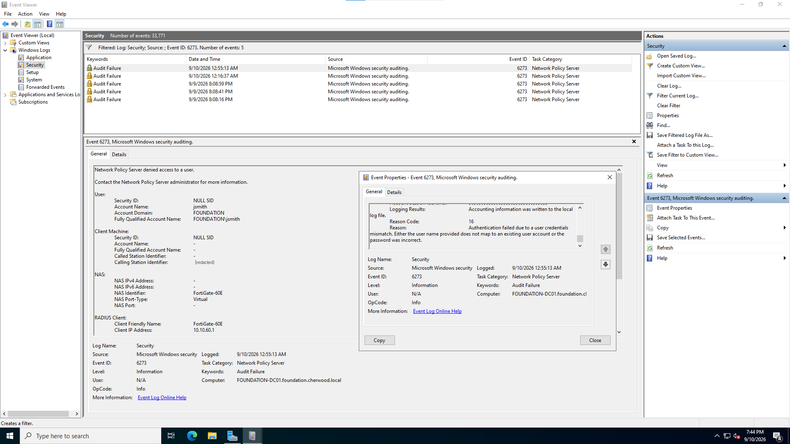
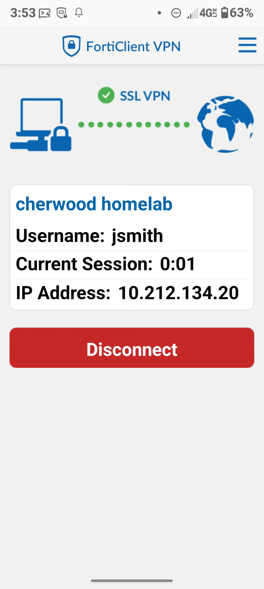
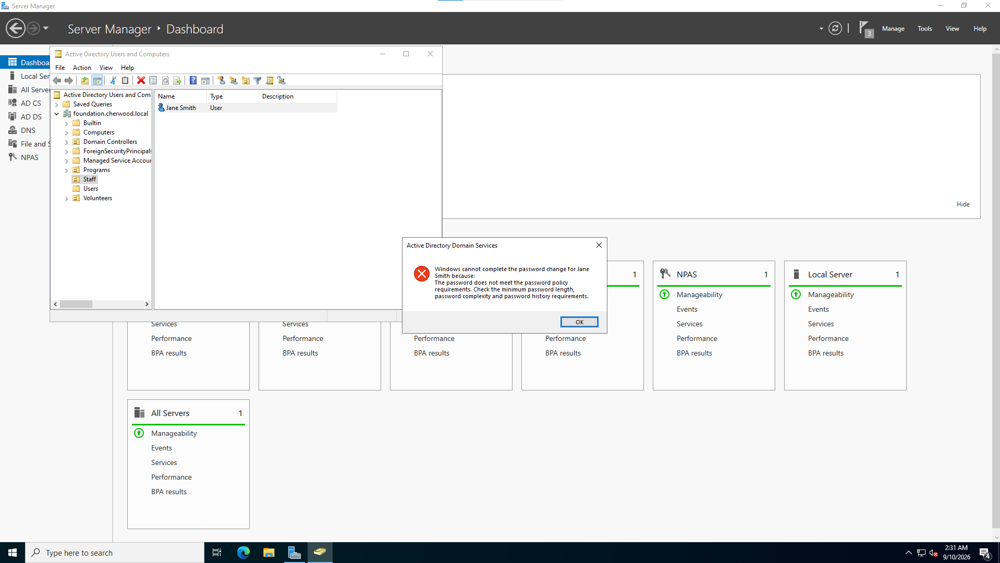
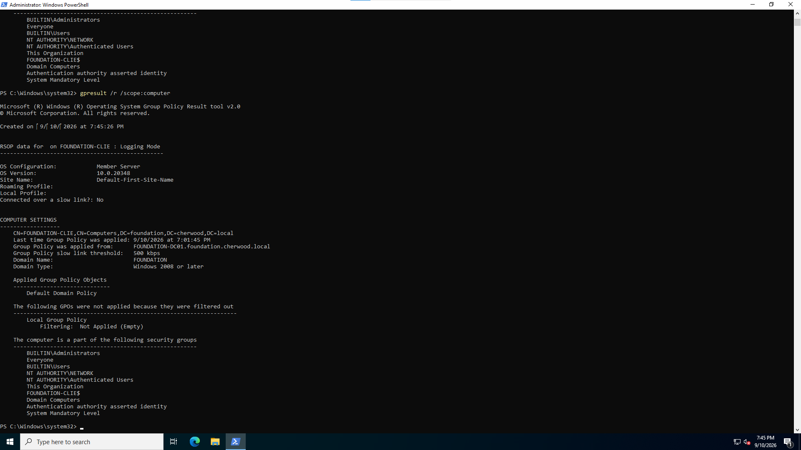
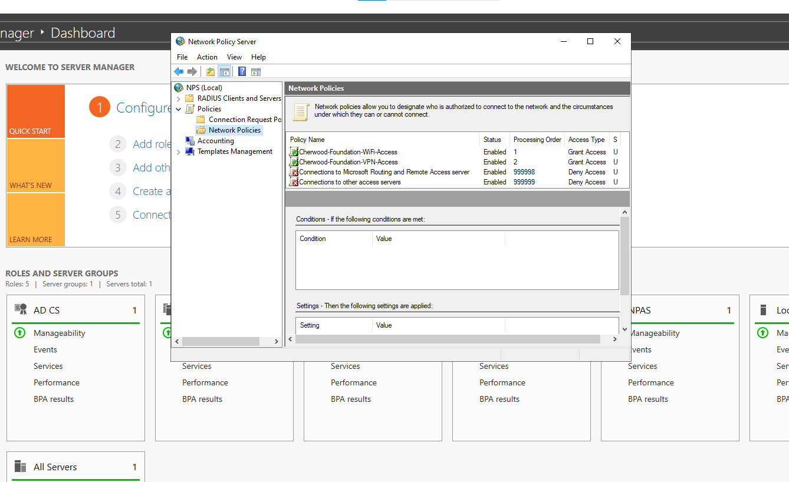
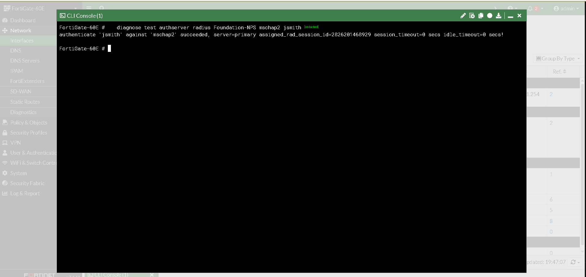
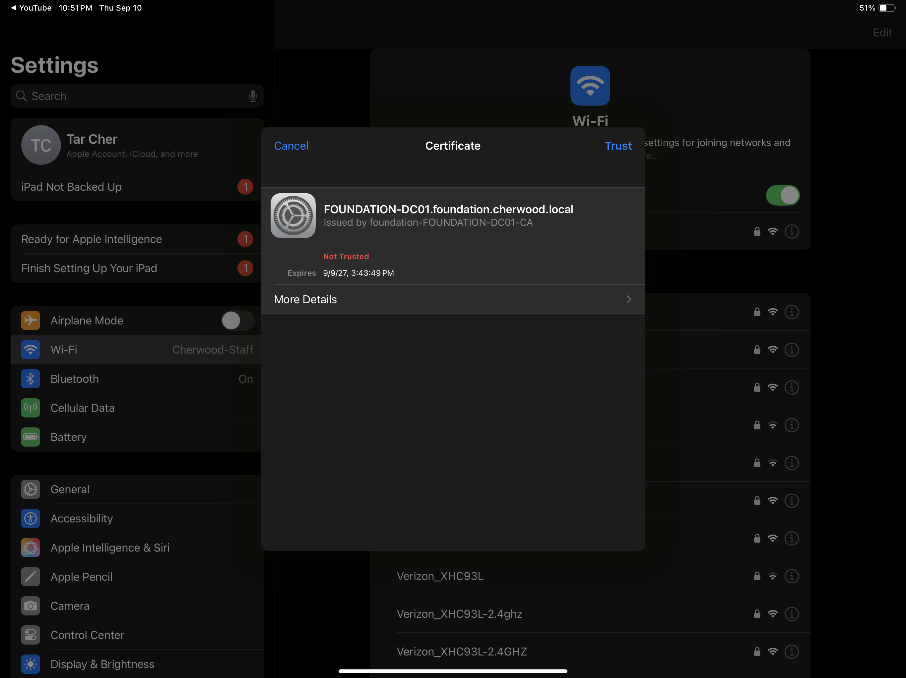
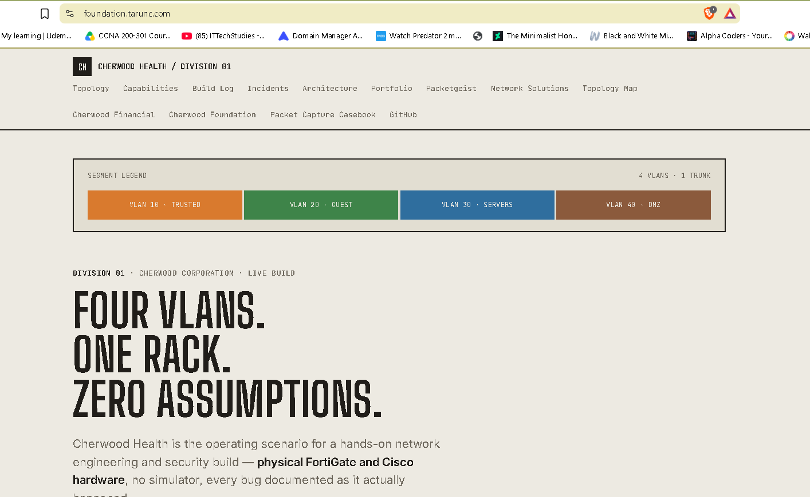
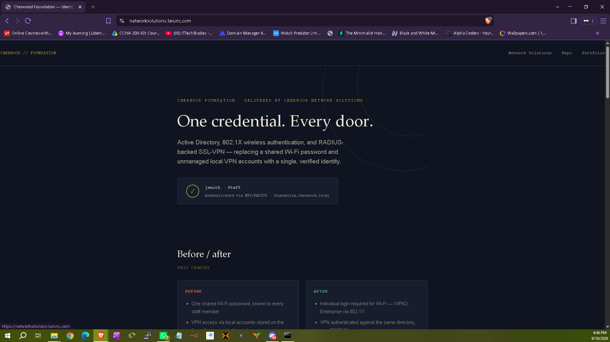

# Cherwood Foundation — Active Directory / 802.1X / SSL-VPN

  

**Client engagement delivered by Cherwood Network Solutions** — Active Directory identity infrastructure, 802.1X wireless authentication, and RADIUS-backed SSL-VPN, built for Cherwood Foundation, a nonprofit client running on a shared Wi-Fi password and unmanaged local VPN accounts.

**At a glance:** one AD identity now gates Wi-Fi, VPN, and every domain-joined machine. Two independent client platforms (Cisco AP, FortiGate) authenticate against the same directory over RADIUS. Every claim below is backed by a server-side log screenshot, not a description of what should happen — see [Verification](#verification).

> 🌐 Live project site: [foundation.tarunc.com](https://foundation.tarunc.com)
> 🔁 GitHub Pages mirror: [taruncherukurigit.github.io/activedirectory-cherwood](https://taruncherukurigit.github.io/activedirectory-cherwood/)
> 🐛 Full build & troubleshooting log: [`CHERWOOD-FOUNDATION-AD-BUILD-DOC.md`](CHERWOOD-FOUNDATION-AD-BUILD-DOC.md)
> 💼 Personal portfolio: [tarunc.com](https://tarunc.com)
> 📦 Delivered by: [Cherwood Network Solutions](https://github.com/taruncherukurigit/network-automation-toolkit) — the internal MSP division of Cherwood Corporation

---

## Why this project exists

A shared Wi-Fi password known to every staff member, and VPN access via local accounts stored directly on the firewall, is exactly what a real, underfunded nonprofit's network typically looks like — no central record of who has access, no way to revoke one person without changing it for everyone, and no audit trail of who authenticated, when, or from where.

This project replaces both with a single Active Directory identity that governs Wi-Fi, VPN, and any future domain-joined machine — the same pattern a real MSP would deliver to a client in this position.

| | Before | After |
|---|---|---|
| Wi-Fi access | One shared password, known to every staff member | Individual login via WPA2-Enterprise / 802.1X |
| VPN access | Local accounts stored on the firewall | Authenticated against the same AD identity, over RADIUS |
| Revoking access | Requires changing the shared credential for everyone | A single, isolated account action |
| Audit trail | None | Every login attempt — granted or denied — logged server-side with a reason code |

## Architecture

```
                         Internet
                            │
                     [FortiGate 60E]
                    SSL-VPN · RADIUS client
                            │
              ┌─────────────┼─────────────┐
              │                            │
      [Cisco AIR-CAP3702I]          [FOUNDATION-DC01]
      802.1X Autonomous AP          10.10.60.20
      RADIUS client                 AD DS · DNS · NPS · AD CS
              │                            │
      Staff Wi-Fi clients          [FOUNDATION-CLIENT01]
      (WPA2-Enterprise/PEAP)       10.10.60.21 — domain-joined
```

NPS on the domain controller acts as the RADIUS server for **two completely different client types** — a Cisco access point speaking 802.1X for wireless, and a FortiGate firewall authenticating SSL-VPN sessions — each governed by its own independent Network Policy, both checking against the same Active Directory identity.

## What's actually built

- **Active Directory Domain Services** — new forest, `foundation.cherwood.local`, AD-integrated DNS
- **A real OU structure** — Staff, Volunteers, Programs — not a flat default-container directory
- **AD Certificate Services** — Enterprise Root CA, issuing the certificate PEAP/802.1X requires
- **NPS (RADIUS)** — two independent Network Policies: one scoped to wireless, one to VPN
- **802.1X wireless (WPA2-Enterprise)** on a Cisco AIR-CAP3702I, replacing a shared PSK with per-user AD logins
- **SSL-VPN via RADIUS** on a FortiGate 60E, replacing local VPN accounts with the same AD identity
- **A domain-joined client machine** (`FOUNDATION-CLIENT01`), with a real AD user — not the built-in Administrator — confirmed logging in
- **Group Policy** — a real, enforced minimum password length, pushed from the DC and verified both structurally (`gpresult`) and behaviorally (a too-short password rejected by AD)

Every piece above is independently tested for both the **valid and invalid case**, with server-side log evidence for each — not a single happy-path demo.

## Verification

| Test | Result | Evidence |
|---|---|---|
| Wi-Fi login, valid credentials | Granted | NPS Security log, Event 6272 |
| Wi-Fi login, invalid credentials | Denied, Reason Code 16 | NPS Security log, Event 6273 |
| SSL-VPN login, valid credentials | Granted, live tunnel assigned | FortiClient connected state |
| Group Policy enforcement | Sub-minimum password rejected | AD password-change dialog |
| GPO applied to client | Confirmed | `gpresult /r /scope:computer` |

Full screenshots for each row are in [`screenshots/`](screenshots/) and referenced inline in the build doc.

## Screenshots

**NPS Event 6272 — Wi-Fi login granted.** Server-side Security log entry, not a client-side "connected" message — `Account Name: jsmith`, `Account Domain: FOUNDATION`, authenticated against the domain controller's own audit log.



**NPS Event 6273 — Wi-Fi login denied, Reason Code 16.** The negative case, proven the same way as the positive one — an invalid login is rejected and logged with a real, specific reason, not silently dropped.



**SSL-VPN — live tunnel, authenticated via RADIUS.** FortiClient connected state showing a real assigned tunnel IP for `jsmith`, authenticated against the same Active Directory identity as the Wi-Fi login above — not a separate local VPN account.



**Group Policy — enforcement proven behaviorally.** Active Directory rejecting a password that fails the enforced minimum-length policy — proof the GPO isn't just configured, it's actively enforced.



**`gpresult` — GPO confirmed applied to the client.** `gpresult /r /scope:computer` on `FOUNDATION-CLIENT01`, showing `Default Domain Policy` under Applied Group Policy Objects — the structural confirmation to go with the behavioral proof above.



**NPS — both Network Policies, independently scoped.** `Cherwood-Foundation-WiFi-Access` and `Cherwood-Foundation-VPN-Access`, both enabled, both granting access — the fix for Bug #6 below, visible directly in the NPS console.



**RADIUS — direct CLI authentication test, bypassing the VPN portal.** `diagnose test authserver radius` run straight from the FortiGate CLI against NPS, returning `succeeded` — the diagnostic technique that isolated Bug #8 below from anything in the SSL-VPN portal layer itself.



**802.1X — certificate trust prompt, mid-handshake.** The exact moment referenced in Bug #7 below — iOS requires this explicit trust confirmation before an otherwise fully-configured PEAP/802.1X connection can complete.



**Active Directory — real OU structure.** `Staff`, `Volunteers`, `Programs` — a deliberate organizational structure, not a flat default-container directory.



**Domain controller — promotion complete.** `FOUNDATION-DC01` fully configured as a domain controller for `foundation.cherwood.local`.



## The real engineering story

Eight real issues came up building this — not a cleaned-up happy path. Full symptom/cause/fix/why-it-matters writeups for all eight are in [`CHERWOOD-FOUNDATION-AD-BUILD-DOC.md`](CHERWOOD-FOUNDATION-AD-BUILD-DOC.md). The two strongest:

**A correctly-scoped policy silently rejected an entirely different kind of traffic.** The wireless Network Policy's "Wireless" condition meant NPS skipped it entirely for VPN's "Virtual" connection type — with no second policy, every VPN login attempt fell through unmatched and was denied, even with perfectly valid credentials. Fixed with a second, independent Network Policy scoped specifically to VPN.

**A failure with zero log output, by design.** A mismatched RADIUS shared secret between the FortiGate and NPS fails completely silently — the packet can't be authenticated well enough to even generate a log entry on either side, so nothing pointed at the cause. Diagnosed by bypassing the SSL-VPN portal layer entirely with `diagnose test authserver radius` on the FortiGate CLI, confirming the mismatch directly against NPS rather than debugging blind through the portal.

Other issues hit and resolved: a silently-failed DNS role install during DC promotion, three separate missing FortiGate firewall policies (RDP to the DC, SSH to the AP, RADIUS to NPS), a Windows network troubleshooter that reverted the DC's static IP mid-build, an iOS certificate-trust prompt stalling an otherwise-healthy 802.1X handshake, and a domain user with valid credentials but no RDP rights on the client machine (domain membership and local machine authorization are two separate things).

## Known limitations (stated honestly, not hidden)

- **Single domain controller.** No redundancy — a production deployment for a real client this size would still warrant at minimum a second DC for DNS/AD availability, even at small scale.
- **Certificate trust is manual on first connect.** The Enterprise Root CA isn't distributed via any automated mechanism (no MDM in scope) — each client device trusts the cert manually on first 802.1X connection, which is exactly what caused Bug 5 above.
- **No conditional access or MFA layer.** AD credentials alone gate both Wi-Fi and VPN — a real production rollout for a client handling any sensitive data would likely add a second factor on the VPN path specifically.
- **Group Policy scope is minimal.** Only a password-length policy is enforced here as a proof of the mechanism; a real deployment would include a fuller baseline (lockout policy, screen-lock timeout, etc.).

## Stack

`Windows Server 2022` · `Active Directory Domain Services` · `AD-integrated DNS` · `NPS (RADIUS)` · `AD Certificate Services` · `Cisco AIR-CAP3702I` (802.1X autonomous AP) · `FortiGate 60E` (SSL-VPN, RADIUS client) · `Group Policy` · `Proxmox VE`

## Repository structure

```
├── index.html                              # The project site (also served via GitHub Pages)
├── CHERWOOD-FOUNDATION-AD-BUILD-DOC.md      # Full build — architecture, exact configs, all 8 bugs
├── README.md
└── screenshots/                            # Evidence — see list below
```

## Related projects

- [**Cherwood Network Solutions**](https://github.com/taruncherukurigit/network-automation-toolkit) — the MSP division that delivered this engagement
- [**Cherwood Health**](https://github.com/taruncherukurigit/cherwood-health) — the segmented enterprise network this MSP also manages
- [**Cherwood Financial — HA/Failover Lab**](https://github.com/taruncherukurigit/hsrp-failover-lab) — another client engagement in the same portfolio

---

*A client engagement within the Cherwood Corporation portfolio — built by Tarun Cherukuri alongside CCNA/CWNA study.*
